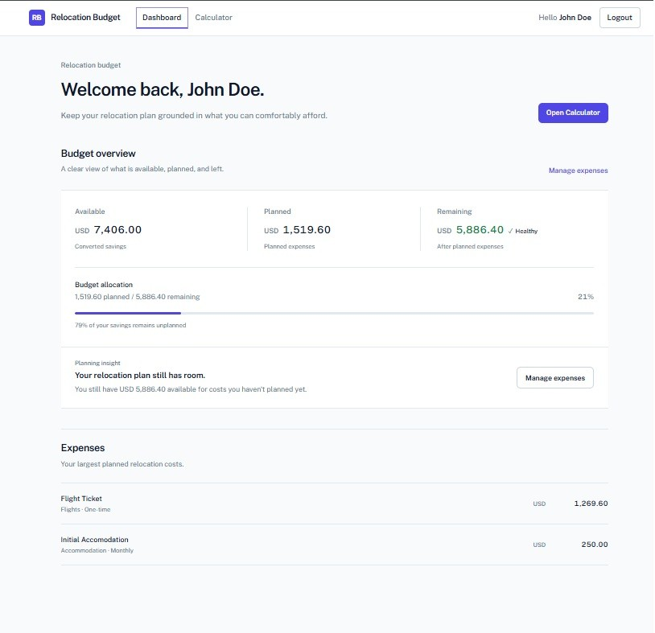
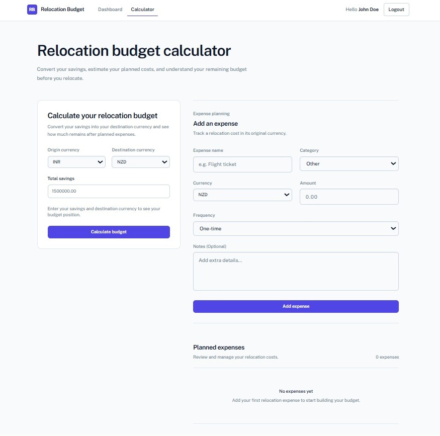

# Relocation Budget

A full-stack MERN application for planning the financial side of an international relocation.

Relocation Budget helps users understand how their savings, planned expenses, currencies, and recurring costs affect their remaining budget and financial runway.

> Built as a production-oriented portfolio project with authentication, REST APIs, MongoDB persistence, multi-currency calculations, validation, error handling, testing, and responsive UI.

---

## Overview

Planning an international move often means dealing with expenses across different currencies and with very different payment frequencies.

Relocation Budget brings those calculations into one place.

Users can:

- Create an account and authenticate securely
- Record their available savings
- Choose origin and destination currencies
- Add, edit, and delete relocation expenses
- Convert expenses into the destination currency
- Calculate total planned expenses
- Calculate remaining budget
- Estimate monthly recurring expenses
- Estimate financial runway
- View an overall relocation budget dashboard

---

## Core Features

### Authentication

- User registration and login
- JWT-based authentication
- HTTP-only authentication cookies
- Protected application routes
- Session restoration after page reload
- Logout support

### Budget Calculator

- Savings input and validation
- Origin and destination currency selection
- Exchange-rate integration
- Same-currency calculations
- Expense conversion into destination currency
- Remaining-budget calculation
- Monthly burn-rate calculation
- Financial-runway calculation
- Loading and error states

### Expense Management

Expenses contain:

- Name
- Category
- Amount
- Currency
- Frequency
- Optional notes

Supported categories:

- Accommodation
- Flights
- Visa
- Logistics
- Food
- Transportation
- Insurance
- Other

Users can create, edit, and delete their planned expenses.

### Multi-Currency Support

The application currently supports:

- INR
- USD
- EUR
- GBP
- NZD
- AUD
- CAD

Exchange rates are retrieved from an external exchange-rate service and used to normalize financial calculations into the selected destination currency.

### Dashboard

The dashboard provides a high-level view of:

- Total savings in destination currency
- Total planned expenses
- Remaining budget
- Budget status
- Monthly recurring expenses
- Financial runway
- Quick access to calculator and expense management

---

## Screenshots

> Screenshots will be added after the final visual polish and deployment stage.

<!--
Add screenshots here later.

Example:




-->

---

## Tech Stack

### Frontend

- React
- Vite
- React Router
- Tailwind CSS
- React Hook Form
- Zod
- JavaScript
- Vitest
- React Testing Library

### Backend

- Node.js
- Express
- MongoDB
- Mongoose
- JWT
- bcryptjs
- Cookie Parser
- CORS
- Vitest
- Supertest

---

## Architecture

Relocation Budget follows a client/server architecture with clear separation between presentation, business logic, API communication, authentication, and persistence.

```text
relocation-budget/
│
├── client/
│   └── src/
│       ├── components/     # Reusable UI components
│       ├── config/         # Frontend configuration
│       ├── context/        # Authentication context
│       ├── data/           # Static application data
│       ├── hooks/          # Reusable React hooks
│       ├── pages/          # Application pages
│       ├── schemas/        # Validation schemas
│       ├── services/       # API communication
│       └── utils/          # Pure calculation utilities
│
├── server/
│   ├── config/             # Database configuration
│   ├── constants/          # Backend constants
│   ├── controllers/        # Request handling
│   ├── middleware/         # Authentication and middleware
│   ├── models/             # Mongoose models
│   ├── routes/             # REST API routes
│   ├── services/           # External service integrations
│   └── utils/              # Backend utilities
│
└── README.md
```

### Request Flow

```text
┌──────────────────────┐
│        User          │
└──────────┬───────────┘
           │
           ▼
┌──────────────────────┐
│    React Frontend    │
│                       │
│ • Authentication      │
│ • Budget Calculator   │
│ • Expense Management  │
│ • Dashboard           │
└──────────┬───────────┘
           │
           │ HTTP / REST API
           ▼
┌──────────────────────┐
│   Express Backend    │
│                       │
│ • Authentication      │
│ • Budget API          │
│ • Expense API         │
│ • Currency API        │
│ • Validation          │
│ • Authorization       │
└──────────┬───────────┘
           │
           ▼
┌──────────────────────┐
│       MongoDB         │
│                       │
│ • Users               │
│ • Budgets             │
│ • Expenses            │
└──────────────────────┘
```

---

## API

### Health

```http
GET /api/health
```

### Authentication

```http
POST /api/auth/register
POST /api/auth/login
POST /api/auth/logout
GET  /api/auth/me
```

### Budget

```http
GET  /api/budget
POST /api/budget
```

### Expenses

```http
GET    /api/expenses
POST   /api/expenses
PATCH  /api/expenses/:id
DELETE /api/expenses/:id
```

### Currency

```http
GET /api/currency/:code
```

### Exchange Rate

```http
GET /api/exchange-rate/:from/:to
```

---

## Validation & Security

Validation is performed at both the frontend and backend layers.

### Frontend

- React Hook Form for form state
- Zod validation schemas
- Currency validation
- Required-field validation
- Positive savings validation
- Positive expense validation
- Accessible validation messages
- Loading and error states

### Backend

- Mongoose schema validation
- Supported currency validation
- Authentication middleware
- JWT verification
- Password hashing with bcrypt
- HTTP-only authentication cookies
- User-scoped database queries
- Expense ownership checks
- Explicit update fields
- Centralized environment configuration
- Production-aware CORS and cookie configuration

---

## Engineering Decisions

This project was developed with emphasis on maintainability and correctness rather than only feature completion.

### Separation of Concerns

Responsibilities are separated across:

- UI components
- Pages
- Context
- Custom hooks
- API services
- Validation schemas
- Calculation utilities
- Controllers
- Models
- Middleware
- External services

### Reusable Business Logic

Currency conversion and budget calculations are implemented as reusable utilities rather than duplicated across components.

### Centralized Configuration

Application configuration such as API URLs, supported currencies, and server environment values is centralized to avoid scattering configuration throughout the codebase.

### Explicit Data Handling

Backend updates use explicit fields instead of blindly passing complete request bodies into database operations.

### User-Scoped Data

Authenticated resources are queried using the authenticated user's identity, preventing users from accessing another user's budget or expenses.

### Error & Loading States

The UI explicitly handles loading, success, error, empty, and validation states for asynchronous operations.

---

## Budget Calculation

The application converts savings and expenses into the selected destination currency before calculating budget insights.

```text
Savings
   │
   ▼
Convert to destination currency
   │
   ▼
Available budget
   │
   ├───────────────────┐
   │                   │
   ▼                   ▼
Planned expenses    Monthly expenses
   │                   │
   ▼                   ▼
Converted total     Monthly burn rate
   │                   │
   └─────────┬─────────┘
             ▼
        Budget insights
             │
             ├── Remaining budget
             └── Financial runway
```

---

## Testing

The project includes automated frontend and backend tests covering core application behavior.

### Frontend

- Component rendering
- Form validation
- Form submission
- Authentication flows
- Dashboard states
- Expense interactions
- Protected routes
- Calculation utilities
- Currency normalization
- API service behavior

### Backend

- Application configuration
- Authentication API
- Budget API
- Expense CRUD API
- Public API endpoints
- Validation and authorization behavior

### Test Results

```text
Frontend: 123 tests passing
Backend:   45 tests passing
Total:    168 tests passing
```

The client also passes:

```bash
npm run lint
npm run build
```

---

## Getting Started

### Prerequisites

Make sure you have:

- Node.js
- npm
- MongoDB

### Clone

```bash
git clone https://github.com/mohdriyaan/relocation-budget.git
cd relocation-budget
```

### Install frontend dependencies

```bash
cd client
npm install
```

### Install backend dependencies

```bash
cd ../server
npm install
```

### Environment Variables

Create `server/.env` using:

```env
PORT=5000
DB_URL=your_mongodb_connection_string
JWT_SECRET=your_jwt_secret
CLIENT_ORIGIN=http://localhost:5173
```

For production, configure the frontend API URL through:

```env
VITE_API_BASE_URL=your_production_api_url
```

> Never commit real credentials, secrets, or private connection strings.

### Start the backend

```bash
cd server
npm run dev
```

### Start the frontend

Open another terminal:

```bash
cd client
npm run dev
```

The development frontend runs on the Vite development server and communicates with the Express API.

---

## Available Scripts

### Client

```bash
npm run dev
npm run build
npm run lint
npm run preview
npm run test
npm run test:run
```

### Server

```bash
npm run dev
npm start
npm run test
npm run test:run
```

---

## Project Status

### Completed

- [x] User registration
- [x] User login and logout
- [x] Protected routes
- [x] Session restoration
- [x] Budget persistence
- [x] Expense CRUD
- [x] Multi-currency calculations
- [x] Exchange-rate integration
- [x] Dashboard
- [x] Frontend validation
- [x] Backend validation
- [x] Authentication and authorization
- [x] Error and loading states
- [x] Business-logic refactoring
- [x] Responsive UI
- [x] Accessibility improvements
- [x] Environment configuration
- [x] Backend hardening
- [x] Frontend and backend test coverage
- [x] Lint and production build verification

### Remaining

- [ ] Deployment
- [ ] Live demo
- [ ] Production screenshots
- [ ] Final repository polish

---

## Project Goals

This project was built to demonstrate practical full-stack engineering rather than only CRUD functionality.

The project focuses on:

- Designing a real-world application
- Building a React frontend
- Designing and consuming REST APIs
- Implementing authentication and authorization
- Persisting user-owned data with MongoDB
- Integrating external services
- Handling validation and asynchronous operations
- Refactoring business logic
- Designing reusable application architecture
- Writing automated tests
- Improving an application iteratively toward production readiness

---

## What This Project Demonstrates

### Frontend Engineering

- Component-based React architecture
- Form management with React Hook Form
- Schema validation with Zod
- Client-side routing
- Authentication state management
- Responsive UI development
- Accessible interaction patterns
- Automated component testing

### Backend Engineering

- REST API design
- Express middleware
- JWT authentication
- HTTP-only cookies
- Password hashing
- MongoDB and Mongoose
- Authorization and ownership checks
- External API integration
- Automated API testing

### Engineering Practices

- Separation of concerns
- Reusable business logic
- Environment-based configuration
- Explicit data handling
- Error handling
- Loading and empty states
- Test-driven verification
- Refactoring toward maintainability

---

## Roadmap

```text
✅ Core application
        │
        ▼
✅ Architecture & refactoring
        │
        ▼
✅ UI/UX overhaul
        │
        ▼
✅ Production configuration
        │
        ▼
✅ Automated testing
        │
        ▼
🚧 Deployment
        │
        ▼
🚧 Final presentation
```

---

## Author

**Mohd Riyaan**
Junior Full-Stack / MERN Developer

GitHub: [@mohdriyaan](https://github.com/mohdriyaan)

---

## License

This project is currently maintained as a portfolio and learning project.
